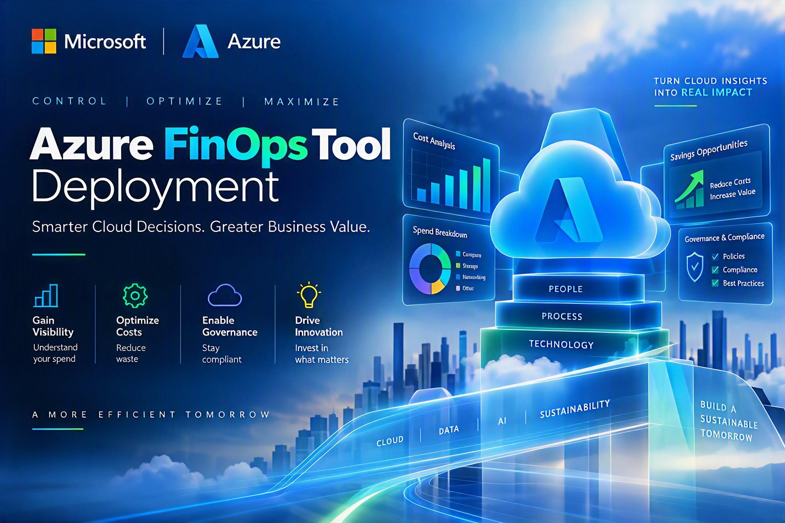
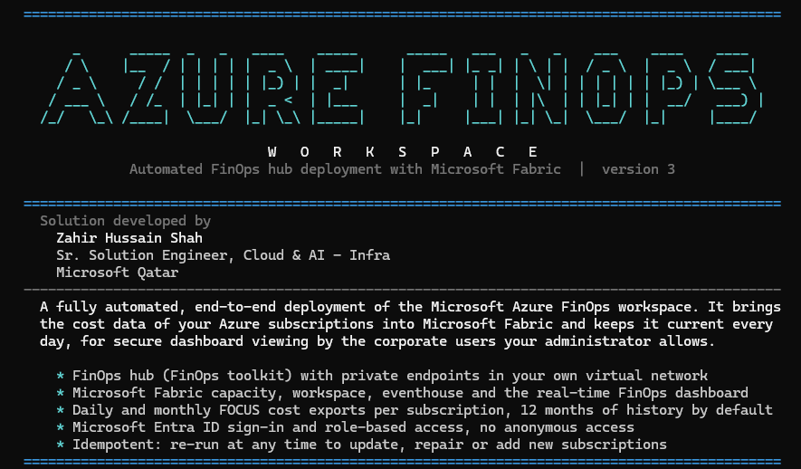
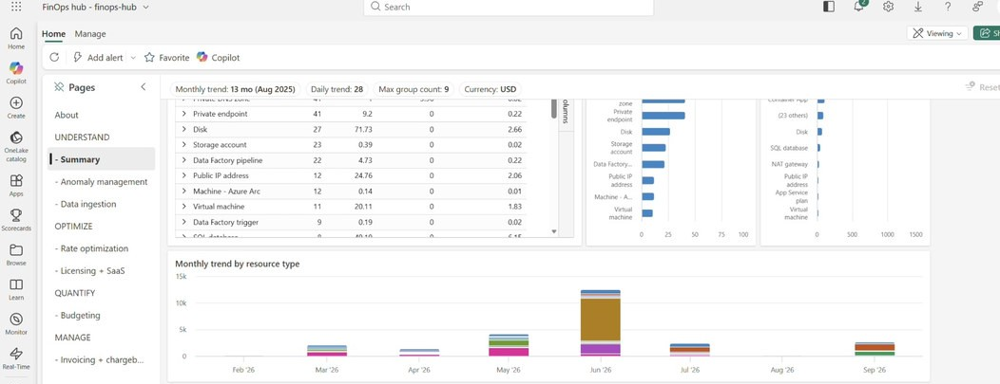
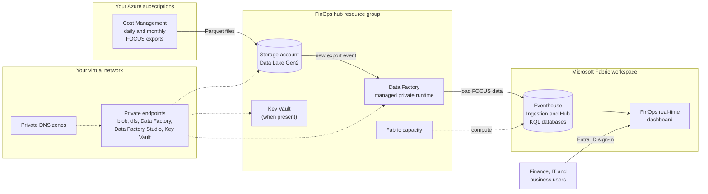
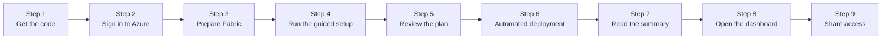
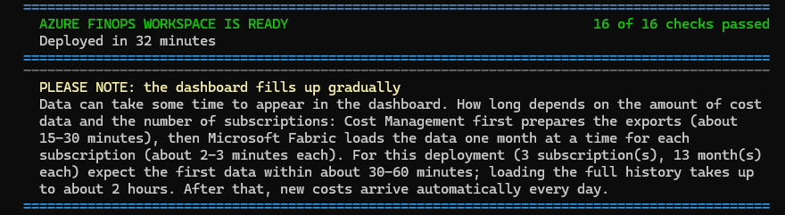
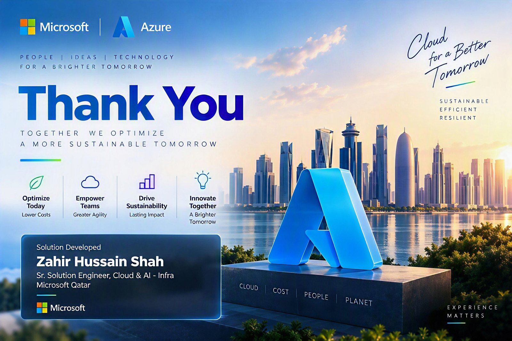

<p align="center">
  
</p>

<div align="center">


# Azure FinOps Automation Deployment Utility

**Azure FinOps Workspace: a private FinOps hub on Microsoft Fabric, deployed end to end with one command**


</div>

Every organization on Azure needs a clear, trusted view of what it spends and why. The Microsoft FinOps toolkit provides the building blocks, but deploying them privately and connecting them to Microsoft Fabric takes expertise across many services and a long list of manual steps. This utility does all of it for you. One PowerShell script deploys, connects, secures and verifies the complete solution, and hands you a working FinOps dashboard.



## Quick start

```powershell
git clone https://github.com/zhshah/Azure-FinOps-Automation-Deployment-Utility.git
cd Azure-FinOps-Automation-Deployment-Utility
az login
./Deploy-FinOpsHub-V3-Fabric.ps1
```

The script guides you through every choice, shows the plan and asks for confirmation before it creates anything. Read [Before you start](#before-you-start) first: it takes five minutes and avoids most problems.

## Contents

- [What this solution is](#what-this-solution-is)
- [Why it exists](#why-it-exists)
- [What end users get](#what-end-users-get)
- [Architecture](#architecture)
- [How the deployment works](#how-the-deployment-works)
- [Before you start](#before-you-start)
- [Step-by-step deployment](#step-by-step-deployment)
- [Unattended deployment](#unattended-deployment)
- [Give people access to the dashboard](#give-people-access-to-the-dashboard)
- [After deployment](#after-deployment)
- [Security and networking](#security-and-networking)
- [Cost](#cost)
- [Parameters](#parameters)
- [Troubleshooting](#troubleshooting)
- [Remove the solution](#remove-the-solution)
- [Repository contents](#repository-contents)
- [Credits, support and license](#credits-support-and-license)

## What this solution is

The **Azure FinOps Workspace** is a fully automated, end-to-end deployment of the [FinOps hub](https://learn.microsoft.com/cloud-computing/finops/toolkit/hubs/finops-hubs-overview) from the Microsoft FinOps toolkit (release 14), with **Microsoft Fabric Real-Time Intelligence** as its data store. One script, `Deploy-FinOpsHub-V3-Fabric.ps1`, builds and connects every layer:

| Layer | What is deployed |
|---|---|
| Data collection | Daily and monthly Cost Management exports in the FOCUS format for every subscription, with 12 months of history backfilled |
| Data pipeline | The FinOps hub: Data Lake storage, Data Factory with a managed private runtime, and event triggers |
| Analytics | A Microsoft Fabric capacity (F2 to F2048), a workspace, an eventhouse and the **Ingestion** and **Hub** KQL databases with the full FinOps toolkit schema |
| Insights | The FinOps hub dashboard, imported as a Fabric real-time dashboard and connected to the Hub database |
| Private networking | Private endpoints in **your** virtual network for storage, Data Factory, Data Factory Studio and Key Vault (when the hub has one), with private DNS zones reused, linked or created |
| Access | Microsoft Entra ID sign-in and role-based access for people and services, with no anonymous access |

It automates every step of the official [FinOps hub deployment guide](https://learn.microsoft.com/cloud-computing/finops/toolkit/hubs/deploy), including the optional "Set up Microsoft Fabric" and "Configure Fabric access" sections, and then checks the result with up to 16 verification tests. A typical run takes 35 to 60 minutes, and nothing needs to be done by hand afterwards.

**Scope:** Azure public cloud, and the subscriptions in the tenant you sign in to (by default, every enabled subscription you can see). Azure Data Explorer is not deployed, because Fabric is the data store.

## Why it exists

Deploying a FinOps solution by hand needs expertise across many domains at the same time: networking and private DNS, identity and role-based access, storage, Data Factory, Cost Management and Microsoft Fabric. Every step is configured manually, so mistakes creep in, integrations fail, and stitching all the pieces together into a fully working solution is hard. This utility turns all of that into one consistent, repeatable deployment.

Some of the problems it solves for you:

| Where manual deployments get stuck | What the utility does |
|---|---|
| Private DNS zones live in a central connectivity subscription, or DNS is managed by policy | Reuses zones already linked to your virtual network in any subscription, links or creates missing zones where you choose, or prints the records for your DNS team |
| Fabric eventhouses cannot load data through a storage firewall ([FinOps toolkit issue #2061](https://github.com/microsoft/finops-toolkit/issues/2061)) | Configures storage access for Fabric ingestion, then re-runs any data loads that failed |
| Data Factory cannot write to the new KQL databases until it is a database admin | Makes the Data Factory identity admin of the Ingestion and Hub databases, then re-runs the hub initialization |
| Exports must be created and backfilled for every subscription | Creates daily and monthly FOCUS exports in each subscription and backfills the history month by month |
| Data Factory keeps showing managed private endpoints as "Pending" | Reads the real state from the target resource and approves pending connections |
| Redeploying within an hour silently skips the template's deployment scripts | Clears finished deployment scripts before each attempt, so the Data Factory triggers are stopped and started correctly |
| Throttling, DNS hiccups and brand-new eventhouses cause transient errors | Retries automatically; every step is idempotent, so a re-run continues where it stopped |

## What end users get

- **A live FinOps dashboard in Microsoft Fabric**, with the FinOps toolkit pages: Summary, Anomaly management, Data ingestion, Rate optimization, Licensing + SaaS, Budgeting, and Invoicing + chargeback.
- **Cost data that stays current on its own.** New costs arrive every day, and each closed month is finalized automatically.
- **One trusted dataset for every subscription**, aligned with the FinOps Open Cost and Usage Specification (FOCUS). Query it with KQL (for example `Costs()` in the Hub database), connect Power BI to it, or use it from your own tools.
- **Copilot in Fabric** (optional): ask questions about cost data in plain language. See [Copilot in Fabric](#copilot-in-fabric).
- **Secure access.** People sign in with Microsoft Entra ID and see the data through Fabric workspace roles.

For the platform team:

- One command, guided or unattended, with pre-flight checks before anything is created.
- Safe to re-run at any time: to repair, to update, to change the Fabric SKU or to add new subscriptions.
- A full transcript and a JSON deployment summary of every run in `./logs`.



## Architecture



How the data flows:

1. Cost Management writes the daily (month to date) and monthly (closed month) FOCUS exports as Parquet files to the hub storage account.
2. Each new export raises a storage event that starts the Data Factory pipelines. They prepare the data and tell the Fabric eventhouse to load it.
3. The eventhouse loads the data into the **Ingestion** database. The **Hub** database exposes ready-to-use functions such as `Costs()`.
4. The real-time dashboard queries the Hub database live, so every load shows up without a refresh schedule.

## How the deployment works

The script runs ten steps. All of them are idempotent: running the script again reuses what exists and only adds or repairs what is missing.

| Step | What happens |
|---|---|
| 1. Pre-flight checks | Verifies the Azure CLI sign-in, Microsoft Fabric API access, the required files, the virtual network and subnet, the region, the Fabric SKU, quota and capacity name, the private DNS plan, the resource providers and every permission it needs. Nothing is created until all checks pass. |
| 2. Fabric capacity | Creates the capacity in the hub region, or reuses, resumes or resizes an existing one. |
| 3. Fabric workspace | Creates the workspace with a workspace identity, the eventhouse and the Ingestion and Hub databases, and runs the FinOps toolkit setup scripts in both databases. |
| 4. FinOps hub | Deploys `template.json` with private access, connected to the eventhouse. |
| 5. Private endpoints | Creates the private endpoints in your subnet and registers them in private DNS. |
| 6. Network hardening | Disables Data Factory public network access and configures storage access for Fabric ingestion. |
| 7. Fabric access | Makes Data Factory admin of both databases, gives your viewers access to the workspace, re-runs the hub initialization and re-queues loads that failed. |
| 8. Cost exports | Creates the daily and monthly FOCUS exports in every subscription and backfills 12 months of history. |
| 9. Dashboard | Imports the FinOps hub dashboard into Fabric and connects it to the Hub database. |
| 10. Verification | Runs the checks below and writes a JSON summary to `./logs`. |

<details>
<summary><b>The 16 verification checks</b></summary>

1. Fabric capacity is active
2. Fabric workspace is on the capacity
3. Fabric workspace identity exists
4. Ingestion and Hub database schema completed
5. Data Factory is admin of both databases
6. Hub initialization pipeline succeeded
7. Storage firewall is configured as expected
8. Fabric workspace resource instance rule is present on the storage account
9. Fabric data loads have no storage access failures
10. Data Factory public network access is disabled
11. Private endpoints are approved
12. Private DNS records point to the private endpoints (skipped with `-SkipPrivateDnsZones`)
13. Data Factory managed private endpoints are approved
14. Data Factory triggers are started
15. Cost exports are configured for every scope (skipped with `-SkipExports`)
16. The Fabric dashboard is imported and connected (skipped with `-SkipDashboard`)

</details>

## Before you start

### Workstation

| Requirement | Notes |
|---|---|
| PowerShell 7.2 or later | Windows, macOS or Linux. [Install PowerShell](https://learn.microsoft.com/powershell/scripting/install/installing-powershell). Windows PowerShell 5.1 is not supported. |
| Azure CLI 2.60 or later | [Install the Azure CLI](https://aka.ms/azcli). The script uses your `az login` session. |
| Outbound HTTPS | `management.azure.com`, `login.microsoftonline.com`, `graph.microsoft.com`, `api.fabric.microsoft.com`, `*.kusto.fabric.microsoft.com`, and `prices.azure.com` (for the list prices shown during setup) |
| A session that can stay open for about an hour | Run the script from a workstation or jump box. Azure Cloud Shell is not recommended, because it ends sessions after 20 minutes without interaction. |

### Azure permissions

| Where | Role | Why |
|---|---|---|
| Hub resource group (or its subscription, if the group doesn't exist yet) | Owner, or Contributor plus User Access Administrator | Deploy the hub and assign roles to its managed identities |
| Hub subscription | Contributor or Owner, unless the resource providers are already registered | Register the Storage, DataFactory, EventGrid, ManagedIdentity, Network, ContainerInstance, KeyVault, CostManagementExports and Fabric providers |
| Virtual network and the private endpoint resource group | Network Contributor | Place the private endpoints in your subnet |
| Private DNS zone resource group | Private DNS Zone Contributor (plus Network Contributor on the virtual network to link zones) | Create or link zones and register the records |
| Every subscription to export | Cost Management Contributor, or higher | Create the exports |

The pre-flight step tests each of these permissions. If anything is missing, it stops before deploying and lists the exact action and scope that is needed.

### Microsoft Fabric

| Requirement | How to check |
|---|---|
| Fabric is set up for your tenant and account | Sign in once at <https://app.fabric.microsoft.com> with the account that runs the script. The first sign-in sets up Fabric for the tenant. If this is missing, the script stops with clear guidance and deploys nothing. |
| The account can create workspaces | Fabric tenant setting, on by default |
| Fabric capacity quota in the hub region | Azure portal > **Quotas** > **Microsoft Fabric**. The guided setup also lists regions where you have quota. |

### Network

| Requirement | Notes |
|---|---|
| An existing virtual network | In any subscription of the tenant. The hub can be in another region, because private endpoints work across regions. |
| A subnet for the private endpoints | No delegation and at least 8 free IP addresses (about 5 are used). A /28 is enough. |
| A private DNS decision | Reuse existing `privatelink` zones (for example in a central connectivity subscription), let the script create them, or skip DNS when Azure Policy or a DNS team manages the records. The zones are `privatelink.blob.core.windows.net`, `privatelink.dfs.core.windows.net`, `privatelink.datafactory.azure.net` and `privatelink.adf.azure.com`, plus `privatelink.vaultcore.azure.net` when the hub has a Key Vault. |
| Custom DNS servers | If the virtual network uses custom DNS servers, they must resolve the `privatelink` zones, for example by forwarding to Azure DNS (168.63.129.16) or through Azure DNS Private Resolver. The pre-flight step warns you when custom DNS servers are configured. |
| Hub internal network | The hub creates its own small isolated network (default `10.20.30.0/26`). Use `-HubVirtualNetworkAddressPrefix` to pick another range if it overlaps networks you may peer later. |

### Checklist

- [ ] PowerShell 7.2+ and Azure CLI 2.60+ are installed
- [ ] You know which subscription, virtual network and subnet to use
- [ ] You know where the private DNS zones live, or that DNS is managed centrally
- [ ] Someone has signed in to Microsoft Fabric in this tenant, and there is Fabric quota in the region
- [ ] You have the permissions listed above
- [ ] Optional: you have the object ID of the Entra ID group that should see the dashboard

## Step-by-step deployment



### Step 1: Get the code

**Option A: Git**

```powershell
git clone https://github.com/zhshah/Azure-FinOps-Automation-Deployment-Utility.git
cd Azure-FinOps-Automation-Deployment-Utility
```

**Option B: ZIP download.** Select **Code** > **Download ZIP** and extract it. Then unblock the files, because Windows marks downloaded files and PowerShell refuses to run them otherwise:

```powershell
cd <extracted folder>
Get-ChildItem -Recurse | Unblock-File
```

Keep the folder structure as it is. The script expects `template.json`, `parametersFile.json`, `finops-hub-dashboard.json`, `fabric/` and `modules/` next to it.

### Step 2: Sign in to Azure

Open PowerShell 7 (`pwsh`) in the folder and sign in with the account that has the permissions above:

```powershell
az login                         # add --tenant <tenant-id> to choose a specific tenant
az account show --output table   # confirm the account and the tenant
```

If you are not signed in, the script starts `az login` for you.

### Step 3: Prepare Microsoft Fabric (once per tenant)

1. Open <https://app.fabric.microsoft.com> and sign in with the same account. Accept the prompts. This first sign-in sets up Fabric for your account and tenant, and it can't be automated.
2. Optional: check the Fabric quota in the region you plan to use (Azure portal > **Quotas** > **Microsoft Fabric**). The guided setup shows the regions with quota anyway.

### Step 4: Run the guided setup

```powershell
./Deploy-FinOpsHub-V3-Fabric.ps1
```

You can add tags and dashboard viewers in the same command:

```powershell
./Deploy-FinOpsHub-V3-Fabric.ps1 -Tags @{ Workload = 'FinOps'; Owner = 'finops-team@contoso.com' } -FabricViewers '<group-object-id>'
```

The script shows the start banner, confirms that it can use Microsoft Fabric, and then asks only for what it needs. In lists, enter a number (Enter picks 1) or type text to filter the list. For questions, press Enter to accept the default shown in brackets.

| # | The script asks | What to answer |
|---|---|---|
| 1 | Subscription for the FinOps hub and the Fabric capacity | The subscription that will host the solution, often a platform or management subscription |
| 2 | Resource group for the FinOps hub | Press Enter for `rg-finops-hub` or type a name. It is created if it doesn't exist. |
| 3 | Existing virtual network for the private endpoints | Your hub or shared-services virtual network. Networks in every subscription you can read are listed. |
| 4 | Subnet for the private endpoints | A subnet without delegation that has at least 8 free IP addresses. Subnets with names like *private* or *endpoint* are listed first. |
| 5 | Azure region for the hub and the Fabric capacity | Press Enter to accept the suggestion. When the virtual network's region has no Fabric quota, the nearest regions with quota are suggested. |
| 6 | Private DNS zones | Choose existing zones (for example in a connectivity subscription), create them in the virtual network's resource group, enter another resource group, or skip when DNS is managed by policy. Zones already linked to the virtual network are always reused. |
| 7 | Fabric capacity SKU | Every SKU that fits your quota is listed with its capacity units and list price per hour and per month. F2 is the lowest cost for a trial. See [Cost](#cost) for production sizing. |
| 8 | Start the deployment? | Review the plan (next step) and answer `Y`. Answer `n` to cancel; nothing is deployed. |

### Step 5: Review the plan

Before anything is created, the script prints the plan. For example:

```text
  Deployment plan
    FinOps hub:        finops-hub in resource group rg-finops-hub (swedencentral), subscription 'Contoso Platform'
    Fabric capacity:   fcfinopshub1a2b3c F8 (8 CU) in rg-finops-hub - ~1.52 USD/hour (~1,110 USD/month if never paused) while active
    Fabric workspace:  FinOps hub - rg-finops-hub - eventhouse FinOpsHub with the Ingestion and Hub databases, real-time dashboard
    Private endpoints: vnet-hub / snet-private-endpoints (endpoint resources in rg-finops-hub)
    Private DNS zones: 4 already linked (reused); 0 to link and 0 to create in rg-private-dns (subscription 00000000-0000-0000-0000-000000000000)
    Cost exports:      3 subscription(s) (every enabled subscription you can see), 12 month(s) of history
    Storage firewall:  allows all networks with Entra ID/RBAC (required for Fabric ingestion)
    Duration:          about 35-60 minutes
    Data in Fabric:    first data about 30-60 minutes after the deployment, full history up to about 2 hours
  Start the deployment? [Y/n]
```

Check the region, the SKU, the network and the DNS lines. The Fabric capacity is billed per hour from the moment it is created.

### Step 6: Let the deployment run

The script now runs the ten steps on its own and shows the elapsed time for each one. The FinOps hub template (step 4) is the longest part, at 20 to 35 minutes. A shortened example:

```text
==> [2/10] Fabric capacity fcfinopshub1a2b3c (F8)   [00:00:52]
    [OK] Created resource group rg-finops-hub (swedencentral)
    [OK] Fabric capacity fcfinopshub1a2b3c is Active (F8) | administrators: admin@contoso.com
==> [3/10] Fabric workspace, eventhouse and databases   [00:01:24]
    [OK] Created eventhouse 'FinOpsHub'
    [OK] Ingestion database schema: 118 commands completed
    [OK] Hub database schema: 39 commands completed
==> [4/10] Deploying the FinOps hub template (private access, Fabric data store)   [00:03:40]
    This takes 20-35 minutes (private networking, deployment scripts).
```

If something fails, the script stops with `DEPLOYMENT FAILED` and the reason. Fix the cause and run the same command again: completed work is reused, and a template deployment that is still running is resumed. A full transcript of every run is saved in `./logs`.

### Step 7: Read the completion summary



The summary shows how many checks passed, followed by these links (hidden in the picture above):

| Link | What it is |
|---|---|
| Dashboard | The FinOps real-time dashboard. It opens in your browser automatically unless you use `-NoBrowser`. |
| Fabric workspace | The workspace with the eventhouse, the databases and the dashboard |
| Eventhouse (KQL) | The query URI of the Ingestion and Hub databases, for KQL tools and Power BI |
| Storage (Power BI) | The Data Lake URL for the FinOps toolkit Power BI storage reports |
| Summary | The JSON summary of this run in `./logs` |

It also prints the exact commands to pause and resume the Fabric capacity.

### Step 8: Open the dashboard and let the data arrive

The dashboard fills up gradually. Cost Management first prepares the exports (about 15 to 30 minutes), and then Fabric loads one month of one subscription at a time (about 2 to 3 minutes each). Expect the first data within 30 to 60 minutes. Loading the full history takes longer on large estates: for example, about 2 hours for 3 subscriptions with 13 months each. After that, new costs arrive automatically every day.

To follow the progress, open the eventhouse in the Fabric workspace and run:

```kusto
// Hub database: cost loaded so far, by month
Costs()
| summarize Rows = count(), Cost = round(sum(EffectiveCost), 2) by Month = startofmonth(ChargePeriodStart)
| order by Month desc
```

```kusto
// Ingestion database: failed loads in the last day (this should return nothing)
.show ingestion failures
| where FailedOn > ago(1d)
```

### Step 9: Share access

Give the people who need the dashboard Viewer access. See [Give people access to the dashboard](#give-people-access-to-the-dashboard).

## Unattended deployment

For repeatable deployments, for example across several environments, keep the parameters in a PowerShell data file. A sample is in [`examples/customer-fabric.psd1`](examples/customer-fabric.psd1):

```powershell
Copy-Item ./examples/customer-fabric.psd1 ./customer.local.psd1   # files named *.local.psd1 are ignored by git
# Edit customer.local.psd1, then run:
$p = Import-PowerShellDataFile ./customer.local.psd1
./Deploy-FinOpsHub-V3-Fabric.ps1 @p
```

Or pass the parameters directly:

```powershell
./Deploy-FinOpsHub-V3-Fabric.ps1 -SubscriptionId 00000000-0000-0000-0000-000000000000 -ResourceGroupName rg-finops-hub `
    -Location swedencentral -FabricCapacitySku F8 `
    -VirtualNetworkName vnet-hub -VirtualNetworkResourceGroupName rg-network -PrivateEndpointSubnetName snet-private-endpoints
```

- The guided questions are skipped when `SubscriptionId`, `ResourceGroupName`, `VirtualNetworkName`, `VirtualNetworkResourceGroupName` and `PrivateEndpointSubnetName` are all passed.
- Always pass `Location` and `FabricCapacitySku` as well. Without `Location`, the script uses the location in `parametersFile.json`. Without `FabricCapacitySku`, it asks for the SKU in an interactive session and otherwise uses F2 (or the current SKU of an existing capacity).
- In a non-interactive session, the script stops at once if a required parameter is missing instead of waiting for input.
- The pre-flight checks run in every mode.

## Give people access to the dashboard

People need the **Viewer** role on the Fabric workspace. It lets them use the dashboard and query the Hub and Ingestion databases, and nothing more.

**Option 1: with the script.** Pass the Entra ID object IDs of users, groups or service principals with `-FabricViewers`, during the first deployment or by running the script again with the same answers or parameter file:

```powershell
$viewers = az ad group show --group "FinOps Dashboard Viewers" --query id --output tsv
./Deploy-FinOpsHub-V3-Fabric.ps1 -FabricViewers $viewers
```

**Option 2: in Fabric.** Open the workspace, select **Manage access** > **Add people or groups**, and choose **Viewer**.

Tips:

- Use an Entra ID group, so access is managed in one place.
- Viewers need at least a free Microsoft Fabric license. The real-time dashboard is a Fabric item, not Power BI content, so a Power BI Pro license is not needed to view it. See [Microsoft Fabric licenses](https://learn.microsoft.com/fabric/enterprise/licenses).

### Copilot in Fabric

Copilot works on paid Fabric capacities (F2 and larger, but not trial capacities). With the FinOps data you can use it to write KQL from plain language, to create a real-time dashboard from a table, or to explore the dashboard data. A Fabric data agent can also answer questions over the Hub database, including its functions such as `Costs()`. Keep in mind:

- Copilot in Fabric uses Azure OpenAI in the US and EU data boundaries. For capacities in other regions (for example Qatar Central or UAE North), a Fabric administrator must turn on the tenant setting that lets data sent to Azure OpenAI be processed outside your capacity's geographic region.
- Copilot uses capacity units from your Fabric capacity.

## After deployment

### How the data stays current

- Cost Management runs the daily export (month to date) every day, and the monthly export (the closed previous month) around the 5th of each month.
- The exports are named `ftk-<storage account>-daily` and `ftk-<storage account>-monthly`, and they are scheduled for 5 years.
- The hub pipelines load every export run into Fabric automatically, and the dashboard always shows live data.

### When to run the script again

Running the script again is always safe. Run it:

- after you add subscriptions, because new subscriptions are not picked up automatically
- to add dashboard viewers, or to change the Fabric SKU (for example `-FabricCapacitySku F16`)
- to repair the setup after a policy or a person changed the networking or permissions
- to renew the exports before their 5-year schedule ends

### Pause and resume the Fabric capacity

The Fabric capacity is billed per hour while it is active. You can pause it when it isn't needed, but no data is loaded while it is paused. Resume it (or run the script again, which resumes it and re-queues the loads that failed). The completion summary prints the exact commands. They look like this:

```powershell
az rest --method post --url "https://management.azure.com/subscriptions/<subscription-id>/resourceGroups/<resource-group>/providers/Microsoft.Fabric/capacities/<capacity-name>/suspend?api-version=2023-11-01"
az rest --method post --url "https://management.azure.com/subscriptions/<subscription-id>/resourceGroups/<resource-group>/providers/Microsoft.Fabric/capacities/<capacity-name>/resume?api-version=2023-11-01"
```

### Logs

Every run writes a transcript (`logs/Deploy-FinOpsHub-V3-Fabric-<timestamp>.log`) and a JSON summary (`logs/deployment-summary-v3-fabric-<timestamp>.json`). They contain your tenant, subscription and resource details, so keep them private. The `logs` folder is excluded from git.

### Update to a newer FinOps toolkit release

`template.json`, `fabric/*.kql` and `finops-hub-dashboard.json` must come from the same FinOps toolkit release. To move to a newer release, replace all of them with the matching files from the [FinOps toolkit releases](https://github.com/microsoft/finops-toolkit/releases), test in a non-production resource group, and then run the script again.

## Security and networking

| Component | How it is configured |
|---|---|
| Data Factory | Public network access is disabled. It is reached through private endpoints in your virtual network (Data Factory and Data Factory Studio), and its managed runtime reaches storage through managed private endpoints. |
| Storage account (Data Lake) | Private endpoints for blob and dfs in your virtual network. Every request needs Microsoft Entra ID (role-based access) or the account key, and anonymous access stays disabled. The firewall allows Fabric to load the data (see the note below). |
| Key Vault | Private endpoint, when the hub template deploys one |
| Microsoft Fabric | A SaaS service protected by Microsoft Entra ID and workspace roles. The workspace identity has a resource instance rule on the storage account. Fabric private links are not configured by this script. |
| Identities | In Fabric, the Data Factory managed identity is admin of the Ingestion and Hub databases (not of the workspace), and the workspace identity is Contributor on its own workspace. People get Viewer on the workspace. The account that runs the script becomes a Fabric capacity administrator. |
| Tags | `-Tags` applies your tags to the resource groups and every resource, including the Fabric capacity. |

**About the storage firewall.** Fabric eventhouses load data by pulling the files from storage. Today, neither the trusted Azure services exception, trusted workspace access, nor Fabric managed private endpoints cover that path. This is [FinOps toolkit issue #2061](https://github.com/microsoft/finops-toolkit/issues/2061), and it was also confirmed while this utility was tested. The script therefore sets the hub storage firewall to allow all networks, while every request still needs Entra ID or key authentication. If your policy doesn't allow that, use `-KeepStorageFirewallClosed`. The rest of the deployment still works, but the cost data stays in storage and does not reach Fabric until the limitation is lifted. The verification step reports the result either way.

## Cost

The cost depends on the Fabric SKU, the region, the number of subscriptions and your agreement. The script shows the live list prices for your region when you choose the SKU. As a guide, here are estimates at Qatar Central pay-as-you-go list prices (September 2026) for a production configuration:

| Tier | Fabric SKU | Estimated per month | Estimated per year |
|---|---|---|---|
| Starter, for smaller estates | F4 | about $1,226 | about $14.7k |
| **Recommended** | **F8** | **about $2,381** | **about $28.6k** |
| Large estates | F16 | about $4,692 | about $56.3k |

- The Fabric capacity is just over half of the total and is billed per hour while it is active. A one-year Fabric reservation lowers that part by about 40%.
- Data Factory's managed private runtime is about 42% of the total. It is billed while data is processed, including its warm-up time, so it grows with the number of subscriptions.
- Storage, private endpoints, private DNS, Event Grid, Azure Monitor logs and Microsoft Defender for Storage add about $75 to $90 a month. The last two are recommended for production but not enabled by the script.
- Prices differ by region. For example, Fabric costs $0.19 per capacity unit per hour in Sweden Central and $0.22 in Qatar Central.
- For a trial, F2 is the lowest-cost SKU.

## Parameters

Run `Get-Help ./Deploy-FinOpsHub-V3-Fabric.ps1 -Full` for the complete help. Parameters passed to the script override `parametersFile.json`.

**Where to deploy**

| Parameter | Description | Default |
|---|---|---|
| `SubscriptionId` | Subscription for the FinOps hub and the Fabric capacity | Asked in guided setup |
| `ResourceGroupName` | Resource group for the hub (and by default the capacity). Created when missing. | Asked in guided setup |
| `Location` | Region of the hub and the Fabric capacity (they must match). It must offer Fabric, and the subscription needs Fabric quota there. | Asked in guided setup |
| `HubName` | FinOps hub name | `finops-hub` |
| `Tags` | Tags for the resource groups and every resource created | none |

**Network**

| Parameter | Description | Default |
|---|---|---|
| `VirtualNetworkName` | Existing virtual network for the private endpoints | Asked in guided setup |
| `VirtualNetworkResourceGroupName` | Resource group of the virtual network | Asked in guided setup |
| `VirtualNetworkSubscriptionId` | Subscription of the virtual network | `SubscriptionId` |
| `PrivateEndpointSubnetName` | Existing subnet without delegation; about 5 IP addresses are used | Asked in guided setup |
| `PrivateEndpointResourceGroupName` | Resource group for the private endpoint resources, in the virtual network's subscription | Hub resource group, or the virtual network's resource group when it is in another subscription |
| `PrivateDnsZoneSubscriptionId` | Subscription that holds your private DNS zones | `VirtualNetworkSubscriptionId` |
| `PrivateDnsZoneResourceGroupName` | Existing resource group for the private DNS zones. Zones there are reused and linked; missing zones are created there. It can't be the hub resource group. | `VirtualNetworkResourceGroupName` |
| `SkipPrivateDnsZones` | Don't create or link private DNS zones. The records are printed so they can be created elsewhere. | off |
| `HubVirtualNetworkAddressPrefix` | Address space (/26 or larger) of the hub's own isolated network | `10.20.30.0/26` |

**Microsoft Fabric**

| Parameter | Description | Default |
|---|---|---|
| `FabricCapacitySku` | F2, F4, F8, F16, F32, F64 ... F2048 | Asked in interactive sessions; F2 (or the current SKU) otherwise |
| `FabricCapacityName` | Capacity name (3 to 63 lowercase letters and digits, starting with a letter). An existing capacity is reused, and a paused one is resumed. | `fc<hub name><6 characters unique to the subscription and resource group>` |
| `FabricCapacityResourceGroupName` | Resource group of the capacity | Hub resource group |
| `FabricCapacityAdmins` | Extra capacity administrators (user principal names, or object IDs for service principals). The signed-in identity is always an administrator. | none |
| `FabricWorkspaceName` | Workspace for the eventhouse and the dashboard | `FinOps hub - <resource group name>` |
| `FabricEventhouseName` | Eventhouse name. The databases are always named Ingestion and Hub. | `FinOpsHub` |
| `FabricViewers` | Entra ID object IDs of users, groups or service principals that get Viewer on the workspace | none |

**Cost data**

| Parameter | Description | Default |
|---|---|---|
| `ExportScopes` | Scopes to export, for example `/subscriptions/<id>` | Every enabled subscription in the tenant |
| `BackfillMonths` | Number of previous months to export (0 to 84; 0 skips the backfill) | `12` |
| `FocusDatasetVersion` | FOCUS dataset version | `1.2-preview` (falls back to `1.0r2` where needed) |
| `EnableRecommendations` | Turns on the Azure Resource Graph recommendations and gives the hub Reader access on the export subscriptions (you need permission to assign roles there) | off |

**Security**

| Parameter | Description | Default |
|---|---|---|
| `AllowDataFactoryPublicAccess` | Keep Data Factory public network access enabled | off |
| `KeepStorageFirewallClosed` | Keep the hub storage firewall closed. Data then stays in storage and does not reach Fabric (see [Security and networking](#security-and-networking)). | off |

**Run control and files**

| Parameter | Description | Default |
|---|---|---|
| `SkipHubDeployment` | Skip the template deployment and reuse the outputs of the last successful run | off |
| `SkipExports` | Don't create Cost Management exports | off |
| `SkipDashboard` | Don't import the Fabric real-time dashboard | off |
| `NoBrowser` | Don't open the dashboard in the browser at the end | off |
| `MaxDeploymentAttempts` | Attempts for the template deployment after a transient error (1 to 5) | `3` |
| `TemplateFile` | FinOps hub ARM template | `template.json` |
| `TemplateParameterFile` | Template parameter values | `parametersFile.json` |
| `DashboardFile` | Dashboard definition to import | `finops-hub-dashboard.json` |
| `FabricSetupScriptFolder` | Folder with the Ingestion and Hub setup scripts | `fabric` |

## Troubleshooting

| What you see | What to do |
|---|---|
| `Microsoft Fabric does not recognize a license ... (UserNotLicensed)` | Sign in once at <https://app.fabric.microsoft.com> with the same account, accept the prompts, wait a few minutes and run the script again. If it persists, ask your Fabric or Microsoft 365 administrator to allow self-service sign-up or to assign a Fabric (Free) license. |
| `Tenant ... wasn't recognized by Microsoft Fabric` | The tenant has never used Fabric. The same first sign-in fixes it. |
| `no Fabric capacity quota left in <region>` | Use one of the regions the message lists, or request quota (Azure portal > **Quotas** > **Microsoft Fabric**). Nothing was deployed. |
| `Missing permissions: ...` | The message lists each missing action and its scope. Get the role and run the script again. |
| `Subnet ... is delegated to a service` | Choose or create a subnet without delegation. A /28 is enough. |
| Warning about custom DNS servers | Make sure your DNS servers resolve the `privatelink` zones, for example by forwarding to Azure DNS. |
| `AADSTS...` errors in the middle of a long run | Your sign-in expired, for example because of a Conditional Access sign-in frequency policy. Run `az login` and run the script again; completed steps are reused. |
| `admin command cannot be executed temporarily due to an internal state transition` | A brand-new eventhouse can do this for a few minutes. The script retries on its own; if it still fails, run the script again. |
| `No such host is known` or other network errors | Temporary DNS or network problems are retried. If they continue, check your network or proxy and run the script again. |
| Cost Management returns 429 (too many requests) during the backfill | The script retries. The daily schedule isn't affected; run the script again later to fill any month that is still missing. |
| The dashboard is still empty after an hour | Run `.show ingestion failures` in the Ingestion database. `Download_Forbidden` means that something, often a policy, closed the storage firewall again. Fix that and run the script again to re-queue the failed loads. |
| `... is not digitally signed` or `cannot be loaded` | The files came from a ZIP download. Run `Get-ChildItem -Recurse \| Unblock-File` in the folder. |
| `DEPLOYMENT FAILED: ...` | Fix the cause shown in the message and run the same command again. All steps are idempotent. |

## Remove the solution

1. In each exported subscription, delete the exports `ftk-<storage account>-daily` and `ftk-<storage account>-monthly` (Cost Management > **Exports**).
2. Delete the Fabric workspace. This removes the eventhouse, both databases and the dashboard.
3. Delete the hub resource group. This removes the storage account, Data Factory, the hub network and the Fabric capacity when it is in the same resource group, and stops their cost.
4. If the private endpoints were created in another resource group (the virtual network's), delete the endpoints named `pe-<resource name>-<blob|dfs|datafactory|portal|vault>` there. Their DNS records are removed with them.
5. Optionally, delete the private DNS zones that the script created, but only if nothing else uses them. In zones that already existed, the script only added a virtual network link named `<virtual network>-<8 characters>`, which you can remove.

## Repository contents

| Path | Purpose |
|---|---|
| `Deploy-FinOpsHub-V3-Fabric.ps1` | The deployment utility (version 3) |
| `template.json` | FinOps hub ARM template (FinOps toolkit release 14) |
| `parametersFile.json` | Template parameter values. `null` means the template default; script parameters override the file. |
| `finops-hub-dashboard.json` | FinOps hub dashboard definition, imported into Fabric |
| `fabric/finops-hub-fabric-setup-Ingestion.kql`, `fabric/finops-hub-fabric-setup-Hub.kql` | Database setup scripts (FinOps toolkit release 14 assets that match `template.json`) |
| `modules/private-endpoints.bicep`, `modules/private-dns-zones.bicep` | Bicep source of the private endpoint and private DNS templates |
| `modules/private-endpoints.json`, `modules/private-dns-zones.json` | The compiled ARM templates that the script deploys |
| `examples/customer-fabric.psd1` | Sample parameters for unattended runs |
| `docs/images/` | Pictures used in this README |
| `logs/` | Created at run time: transcripts and JSON summaries (excluded from git) |

## Credits, support and license

- **Built on** the [Microsoft FinOps toolkit](https://github.com/microsoft/finops-toolkit). `template.json` and the `fabric` setup scripts come from FinOps toolkit release 14, and `finops-hub-dashboard.json` is the toolkit's FinOps hub dashboard. They are used under the toolkit's MIT License.
- **Support.** This utility is provided as is. The Azure and Microsoft Fabric services it deploys are covered by your normal Microsoft support, but the script itself is community supported and is not an official Microsoft product. For questions or problems, open a [GitHub issue](https://github.com/zhshah/Azure-FinOps-Automation-Deployment-Utility/issues) or contact your Microsoft account team. Customers with a Unified support contract can also ask their Cloud Solution Architect to run the deployment with them.
- **License.** MIT. See [LICENSE](LICENSE), which also contains the FinOps toolkit license notice.

<p align="center">
  
</p>

<div align="center">

**Solution Developed:**

Zahir Hussain Shah<br>
Sr. Solution Engineer, Cloud & AI - Infra<br>
Microsoft Qatar

</div>
